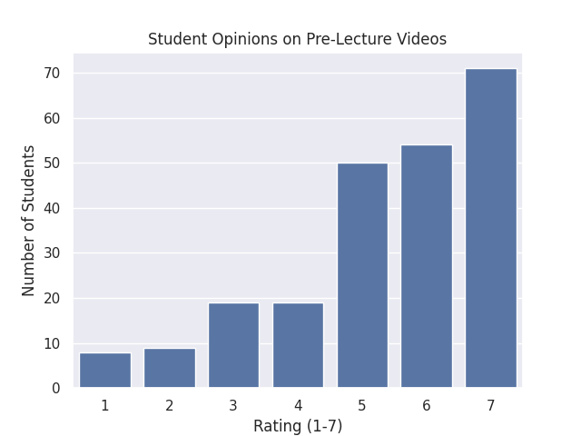
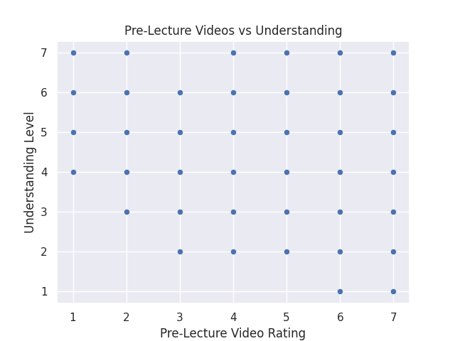
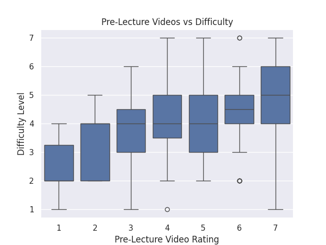

---
# Do not edit the text between these lines!
layout: default
---

# COMP110 Data Analysis Project

## Summary of Analysis

In this project, I analyzed survey data from COMP110 students to determine whether adding optional pre-lecture videos would create value for students.

Pre-lecture videos are designed to help students prepare for lecture content ahead of time. Because students enter COMP110 with different levels of experience, these videos could improve understanding and make lectures more effective.

To explore this idea, I analyzed student responses to the pre-lecture video question and compared it with their reported understanding and perceived course difficulty.

---

## Visualizations

### Student Opinions on Pre-Lecture Videos

This graph shows how students rated the usefulness of pre-lecture videos. A large number of students rated them highly, suggesting strong support for the idea.

---

### Pre-Lecture Videos vs Understanding

This graph compares student interest in pre-lecture videos with their understanding of the course. It helps show whether students who feel less confident are more likely to want additional resources.

---

### Pre-Lecture Videos vs Difficulty

This graph compares interest in pre-lecture videos with how difficult students find the course. It helps identify whether students who struggle more are more likely to support pre-lecture videos.

---

## Conclusion

Based on my analysis, the data suggests that many students support the idea of adding optional pre-lecture videos. Students who may struggle with understanding or find the course difficult appear more likely to benefit from additional resources.

However, there are trade-offs. Creating pre-lecture videos requires additional time and effort from instructors, and some students may rely too heavily on them.

Overall, the data supports the idea that pre-lecture videos could improve the learning experience in COMP110. Future improvements could include testing short optional videos and collecting more data on their effectiveness.
